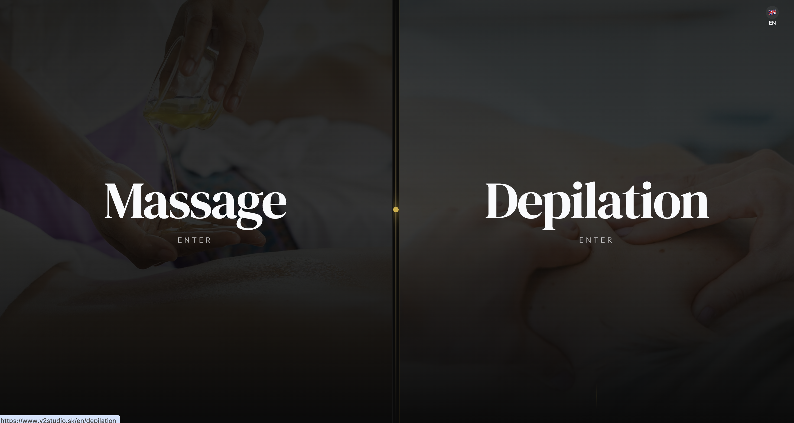
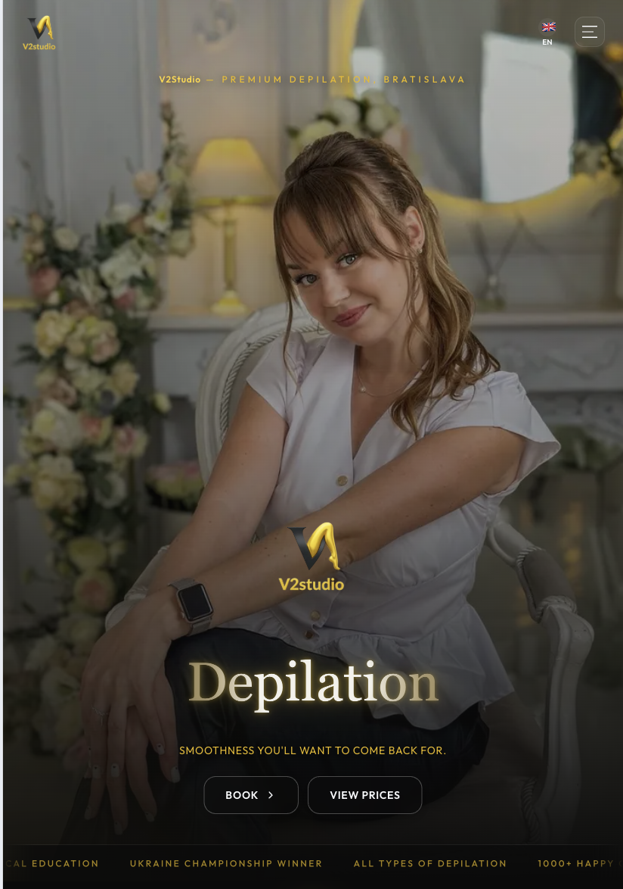

<div align="center">


# V2studio · Epilroom

### Premium massage & waxing studio — Bratislava
**Multilingual booking platform with a full admin back-office, WhatsApp + email notifications, and a custom drag-and-drop calendar.**

[](https://nextjs.org/)
[](https://www.typescriptlang.org/)
[](https://tailwindcss.com/)
[](https://firebase.google.com/)
[](https://authjs.dev/)
[](https://vercel.com/)
[](.github/workflows/ci.yml)
[](#license)

[**Live site →**](https://v2studio.sk) &nbsp;·&nbsp; [**Instagram**](https://www.instagram.com/epilroom_bratislava) &nbsp;·&nbsp; [**Facebook**](https://www.facebook.com/people/Epilroom-Bratislava/61567948520222/) &nbsp;·&nbsp; [**Google Maps**](https://maps.app.goo.gl/4uaHzXpmc6QCWfH79)

</div>

---

## Overview

**V2studio** is the production booking platform for a high-end massage & depilation studio at *Krížna 36, Bratislava*. It pairs a marketing-grade public site (deep-scroll landings, glass-morphism navbar, aurora gradients) with a battle-tested admin back-office used by master therapists every day.

The site is **fully multilingual** (Slovak · English · Russian · Ukrainian), bookings are stored in **Firestore**, confirmations go out via **Resend (email)** and **Twilio (WhatsApp templates)**, and **Vercel Cron** drives the reminder + status-finalization pipeline.

<div align="center">
  
</div>

---

## Highlights

### Public site
- **Entry portal** — split-screen choice between *Massage* and *Depilation* experiences
- **Two themed landings** with a glass-morphism navbar, tilt-and-glow service cards, membership tiers (Silver / Black / Obsidian), studio video, marquee and accordion FAQs
- **Multi-step booking flow** with custom calendar, time-slot picker, occupied-slot guards and per-place accent colors
- **Public price catalog** (synced from Firestore) with bookable lines, sectioned by zone for depilation
- **i18n** via `next-intl` — SK / EN / RU / UK, language switcher in the navbar
- **SEO-grade metadata** — canonical URLs, sitemap.xml, robots.txt, JSON-LD, Open Graph, Twitter cards, GSC verification
- **Cookie consent** banner with granular toggles and `next/analytics` gated behind opt-in

### Admin back-office (`/[locale]/admin`)
- **Drag-and-drop calendar** (week / month / agenda) built on `@dnd-kit`
- **TBD queue** — appointments that still need a date/time stay in a separate list until scheduled
- **Multi-day & full-day** bookings (e.g. cosmetology courses)
- **Inline price catalog editor** — sections, zones, prices, multilingual labels, "bookable" toggles auto-sync to Firestore services
- **Client cards** — phone, opt-ins, birthday, visit timeline (CRM-style activity feed)
- **Analytics & PDF export** (`jspdf-autotable`)
- **Working-hours & prep-buffer** management per place
- **Studio video manager**, language switcher, sign-in via NextAuth v5 (email/password + Google)

### Notifications & automation
- **Resend** — branded HTML emails on booking, cancellation, reschedule
- **Twilio WhatsApp Content Templates** — approved transactional messages to customer **and** the right master phone (massage vs depilation routing)
- **Signed action tokens** (HMAC) — one-tap *Confirm* / *Cancel* buttons inside WhatsApp reminders
- **Vercel Cron**
  - `0 6 * * *` → reminders (2 days out · 1 day out · day-of)
  - `0 3 * * *` → finalize booking statuses (no-show, completed)

---

## Screenshots

<div align="center">
  
  <p><em>Entry portal — split-screen choice between Massage and Depilation</em></p>
</div>

<table>
  <tr>
    <td align="center" width="50%">
      <br/>
      <sub><b>Laptop</b></sub>
    </td>
    <td align="center" width="50%">
      <br/>
      <sub><b>Tablet</b></sub>
    </td>
  </tr>
  <tr>
    <td align="center" colspan="2">
      <br/>
      <sub><b>Mobile</b></sub>
    </td>
  </tr>
</table>

---

## Tech stack

| Layer | Tools |
|---|---|
| **Framework** | [Next.js 14](https://nextjs.org/) (App Router, RSC) · [React 18](https://react.dev/) · [TypeScript 5](https://www.typescriptlang.org/) |
| **Styling** | [Tailwind CSS](https://tailwindcss.com/) · [tailwind-merge](https://github.com/dcastil/tailwind-merge) · [class-variance-authority](https://cva.style/) · custom design tokens (aurora gradients, gold/purple glows) |
| **UI primitives** | [Radix UI](https://www.radix-ui.com/) (Dialog · Select · Accordion · Checkbox · Label) · [shadcn/ui](https://ui.shadcn.com/) patterns · [Lucide](https://lucide.dev/) icons |
| **Motion & UX** | [Framer Motion](https://www.framer.com/motion/) · [Sonner](https://sonner.emilkowal.ski/) toasts · [Unicorn Studio](https://www.unicorn.studio/) hero · custom Wheel date picker |
| **Forms & validation** | [react-hook-form](https://react-hook-form.com/) · [Zod](https://zod.dev/) · [@hookform/resolvers](https://github.com/react-hook-form/resolvers) · [libphonenumber-js](https://gitlab.com/catamphetamine/libphonenumber-js) |
| **Drag & drop** | [@dnd-kit/core](https://dndkit.com/) + sortable + utilities |
| **Backend & data** | [Firebase / Firestore](https://firebase.google.com/) (web SDK v12) · [Firestore emulator](https://firebase.google.com/docs/emulator-suite) for local + CI |
| **Auth** | [NextAuth v5 (Auth.js)](https://authjs.dev/) — credentials + Google |
| **i18n** | [next-intl](https://next-intl-docs.vercel.app/) — SK · EN · RU · UK |
| **Notifications** | [Resend](https://resend.com/) (email) · [Twilio WhatsApp Content Templates](https://www.twilio.com/docs/content) |
| **PDF** | [jsPDF](https://github.com/parallax/jsPDF) + [jspdf-autotable](https://github.com/simonbengtsson/jsPDF-AutoTable) |
| **Analytics** | [@vercel/analytics](https://vercel.com/docs/analytics) (gated by cookie consent) |
| **Testing** | [Vitest](https://vitest.dev/) · [React Testing Library](https://testing-library.com/) · [Playwright](https://playwright.dev/) · [MSW](https://mswjs.io/) |
| **Hosting & ops** | [Vercel](https://vercel.com/) (production) + [Vercel Cron](https://vercel.com/docs/cron-jobs) · [GitHub Actions](https://github.com/features/actions) CI |

---

## Project structure

```
luxe-salon/
├── app/
│   ├── [locale]/                 # next-intl routed pages
│   │   ├── page.tsx              # Entry portal (Massage | Depilation)
│   │   ├── massage/              # Landing + /price + /booking
│   │   ├── depilation/           # Landing + /price + /booking
│   │   ├── booking/              # Confirm / cancel landings & action tokens
│   │   ├── admin/                # Sign-in, calendar, price catalog, studio video
│   │   ├── cookies/  privacy/    # Legal pages
│   ├── api/
│   │   ├── admin/                # Appointments + clients CRUD
│   │   ├── auth/                 # NextAuth v5 routes
│   │   ├── booking/              # Confirm / cancel (signed tokens)
│   │   ├── cron/                 # send-reminders · finalize-statuses (Vercel Cron)
│   │   ├── price-catalog/  services/  schedule/  send-confirmation/
│   ├── sitemap.ts  robots.ts     # SEO
│   └── layout.tsx                # Root layout (fonts, metadata, OG)
├── components/                   # ~50 feature components
│   ├── booking-flow/             # Multi-step booking (Service → Date → Time → Customer)
│   ├── ui/                       # shadcn-style primitives
│   └── Admin*.tsx                # Calendar, modals, drag/drop, analytics
├── lib/                          # Domain logic (60+ modules)
│   ├── firebase.ts               # Firestore client
│   ├── book-appointment.ts       # End-to-end booking transaction
│   ├── booking-store.ts          # Booking state machine
│   ├── price-catalog-*.ts        # Catalog model, normalize, seed, sync
│   ├── whatsapp-admin-notify.ts  # Twilio integration
│   ├── booking-action-token.ts   # HMAC-signed action links
│   ├── seo.ts  social-seo.ts     # Metadata builders
│   └── notify-channels.ts        # Resend + WhatsApp orchestration
├── i18n/                         # next-intl routing + request config
├── messages/                     # sk · en · ru · uk
├── scripts/                      # tsx maintenance scripts (seed, rebuild, test)
├── tests/  e2e/                  # Vitest + Playwright
├── firestore.rules  firestore.indexes.json
├── vercel.json                   # Cron schedule
└── .github/workflows/ci.yml      # typecheck+lint · unit (Firestore emulator) · Playwright smoke
```

---

## Design system

| Token | Value |
|---|---|
| **Background** | `nearBlack` `#0a0a0a` |
| **Foreground** | `icyWhite` `#f8fafc` |
| **Accent — aurora** | `white → yellow #fbbf24 → magenta #ec4899` |
| **Accent — gold** | `soft #E8B800` / `glow #FFD633` |
| **Accent — purple** | `soft #9333EA` / `glow #C084FC` |
| **Typography** | `DM Serif Display` (headings) + `Outfit` (body) |
| **Motion** | Aurora pulse, shimmer sweep, glow pulse, marquee, float, slide-up-fade |
| **Effects** | Glass-morphism, neon borders, glow rings, soft-pulse CTAs |

Defined in [tailwind.config.ts](tailwind.config.ts) and the safelist for runtime calendar colors.

---

## Getting started

```bash
git clone git@github.com:EuvhenRight/Massage.git
cd luxe-salon
npm install
cp .env.example .env.local       # then fill in the keys you need
npm run dev                      # http://localhost:3000
```

### Run with the Firestore emulator

```bash
npm run emulators                # starts firestore on :8080
# in a second shell
npm run dev
```

---

## Environment variables

The full reference lives in [.env.example](.env.example). The essentials:

| Variable | Purpose |
|---|---|
| `NEXT_PUBLIC_SITE_URL` | Canonical site URL — required in production for SEO, OG, sitemap |
| `NEXT_PUBLIC_GOOGLE_SITE_VERIFICATION` | Optional Google Search Console verification |
| `RESEND_API_KEY` · `RESEND_FROM_EMAIL` · `ADMIN_EMAIL` | Booking confirmation emails |
| `TWILIO_ACCOUNT_SID` · `TWILIO_AUTH_TOKEN` · `TWILIO_MESSAGING_SERVICE_SID` | WhatsApp transport |
| `TWILIO_CONTENT_SID_*` | Approved Content Template SIDs (booking new/cancelled/rescheduled, reminders, staff alerts) |
| `ADMIN_WHATSAPP_PHONE` · `MASSAGE_MASTER_WHATSAPP_PHONE` · `DEPILATION_MASTER_WHATSAPP_PHONE` | E.164 numbers — routing depends on `bookingPlace` |
| `BOOKING_ACTION_SECRET` | HMAC secret for signed confirm/cancel links — `openssl rand -hex 32` |
| `CRON_SECRET` | Shared secret Vercel Cron attaches to scheduled calls |
| `NEXT_PUBLIC_FACEBOOK_APP_ID` · `NEXT_PUBLIC_TWITTER_SITE` · `NEXT_PUBLIC_TWITTER_CREATOR` | Social link previews |

> **Twilio sandbox:** every receiving handset must first send `join <sandbox-keyword>` from WhatsApp to the Twilio sandbox number. Production uses an approved WhatsApp sender — swap `TWILIO_MESSAGING_SERVICE_SID` accordingly.

---

## Scripts

| Command | What it does |
|---|---|
| `npm run dev` | Next.js dev server |
| `npm run build` / `npm run start` | Production build / serve |
| `npm run typecheck` | `tsc --noEmit` |
| `npm run lint` | `next lint` |
| `npm test` / `npm run test:watch` / `npm run test:coverage` | Vitest |
| `npm run test:e2e` / `test:e2e:headed` / `test:e2e:ui` | Playwright |
| `npm run emulators` / `emulators:exec` | Firestore emulator |
| `npm run seed:price-catalog` | Seed Firestore with the price catalog |
| `npm run seed:studio-video` | Seed the studio-video doc |
| `npm run rebuild-days` | Rebuild `/days` aggregates from `/appointments` |
| `npm run test:whatsapp` | Smoke-test the Twilio admin alert |
| `npm run test:notify` | Smoke-test the notification channel pipeline |
| `npm run test:crud` | End-to-end CRUD against Firestore |

---

## Continuous integration

[.github/workflows/ci.yml](.github/workflows/ci.yml) runs three jobs on Node 22:

1. **Static** — `typecheck` + `lint`
2. **Unit + integration** — Vitest under the Firestore emulator (Java 17 / temurin); coverage uploaded as artifact
3. **E2E smoke** — Playwright

CI runs on `pull_request` and `push` to `master` / `main`.

---

## Deployment

- **Production:** Vercel — `master` → auto-deploy. Cron jobs are configured in [vercel.json](vercel.json).
- **Firebase:** Firestore (rules in [firestore.rules](firestore.rules), composite indexes in [firestore.indexes.json](firestore.indexes.json)).
- **Domain:** [v2studio.sk](https://v2studio.sk)

---

## Documentation

Operational and staff-facing docs live under [docs/](docs/):

- [ADMIN_MANUAL.md](docs/ADMIN_MANUAL.md) — staff guide (mirrored in the in-app `/admin/help` page)
- [ADMIN_AUTH_SETUP.md](docs/ADMIN_AUTH_SETUP.md) — NextAuth provisioning
- [FIRESTORE_INDEXES.md](docs/FIRESTORE_INDEXES.md) — composite index reference
- [TWILIO_TEMPLATES.md](docs/TWILIO_TEMPLATES.md) — WhatsApp Content Template authoring guide
- [TESTING.md](docs/TESTING.md) — local test workflow

---

## Accessibility

- Semantic HTML (`<main>`, `<section>`, `<nav>`, `<article>`)
- ARIA labels on all interactive elements
- Visible focus states across buttons, links and form fields
- WCAG AA contrast on body text and CTAs
- `prefers-reduced-motion` honored where it does not break iOS Low-Power-Mode panels

---

## Contact

| | |
|---|---|
| **Studio** | V2studio · Epilroom |
| **Address** | Krížna 36, 811 07 Bratislava, Slovakia |
| **Phone** | [+421 95 213 32 58](tel:+421952133258) |
| **Email** | [V2studiosk@gmail.com](mailto:V2studiosk@gmail.com) |
| **WhatsApp** | [wa.me/421952133258](https://wa.me/421952133258) |
| **Instagram** | [@epilroom_bratislava](https://www.instagram.com/epilroom_bratislava) |
| **Facebook** | [Epilroom Bratislava](https://www.facebook.com/people/Epilroom-Bratislava/61567948520222/) |
| **Maps** | [Google Maps](https://maps.app.goo.gl/4uaHzXpmc6QCWfH79) |

---

## License

[MIT](LICENSE) · Copyright (c) 2026 V2studio · Built with ❤️ by [@EuvhenRight](https://github.com/EuvhenRight)
