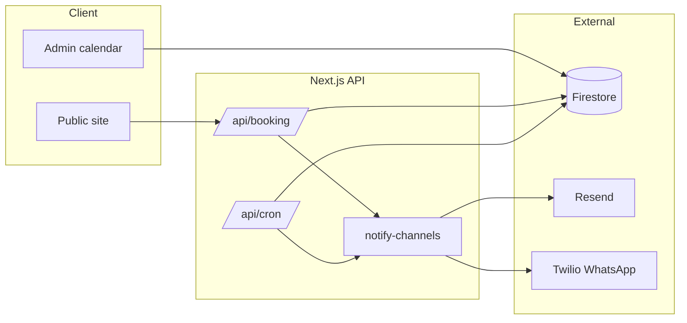

<div align="center">

# V2studio · Epilroom

**Booking platform for a premium massage & waxing studio in Bratislava.**
*Solo build for a working salon — in production at [v2studio.sk](https://v2studio.sk).*

[](https://v2studio.sk)
[](https://www.v2studio.sk/en)
[](LICENSE)
[](https://nextjs.org/)
[](https://www.typescriptlang.org/)
[](https://firebase.google.com/)

<br/>

<a href="https://v2studio.sk"></a>

<sub>Quadrilingual site · Drag-and-drop admin calendar · WhatsApp + email pipeline</sub>

</div>

---

## Overview

A working salon on Krížna 36 needed a booking site its own therapists could run — not a Calendly embed, not a shared Google Sheet. The result is a Slovak / English / Russian / Ukrainian public site tied to a Firestore-backed admin back-office, with WhatsApp reminders driven by Vercel Cron.

Built solo for V2studio · Epilroom. It's a live business tool, not a portfolio demo — the calendar, price catalog and notification pipeline are what the staff use every day.

## Features

| | |
| :--- | :--- |
| **Multilingual public site** | SK / EN / RU / UK via `next-intl`, switcher in the navbar. |
| **Multi-step booking flow** | Custom calendar, occupied-slot guards, per-place accent colors. |
| **Admin drag-and-drop calendar** | Week / month / agenda views on `@dnd-kit`, TBD queue for unscheduled work. |
| **Inline price catalog editor** | Sections, zones and bookable toggles auto-sync to Firestore services. |
| **Signed action tokens** | HMAC one-tap confirm/cancel links delivered inside WhatsApp reminders. |
| **Automated reminders** | Vercel Cron fires reminders (2d / 1d / day-of) and closes stale bookings. |
| **Twilio Content Templates** | Approved WhatsApp messages routed to the right master per service. |
| **Client cards** | Phone, opt-ins, birthday and visit timeline as a CRM-style feed. |
| **Analytics + PDF export** | `jspdf-autotable` reports; `@vercel/analytics` gated behind cookie consent. |

## Screenshots

| | |
| :--- | :--- |
| [](public/images/Screenshot-home.png) | [](public/images/Screenshot-laptop.png) |

## Tech Stack

**Framework:** Next.js 14 (App Router, RSC) · React 18 · TypeScript 5
**UI:** Tailwind CSS 3.4 · Radix UI · shadcn/ui patterns · Lucide
**Motion:** Framer Motion · Sonner · Unicorn Studio hero
**Forms:** react-hook-form · Zod · libphonenumber-js
**Data:** Firebase / Firestore (web SDK v12) · Firestore emulator for local + CI
**Auth:** NextAuth v5 (credentials + Google)
**i18n:** next-intl (SK · EN · RU · UK)
**Notifications:** Resend · Twilio WhatsApp Content Templates
**Ops:** Vercel · Vercel Cron · GitHub Actions
**Testing:** Vitest · React Testing Library · Playwright · MSW

## Architecture

Next.js App Router serves the multilingual public site and the `/admin` back-office from the same origin. Firestore holds appointments, clients and the price catalog; the admin calendar subscribes to snapshot listeners for live updates. Vercel Cron hits two internal API routes daily, which fan out through a single notification channel to Resend and Twilio.


```mermaid
flowchart LR
  subgraph Client
    Site[Public site]
    Admin[Admin calendar]
  end
  subgraph Server[Next.js API]
    Booking[/api/booking/]
    Cron[/api/cron/]
    Notify[notify-channels]
  end
  subgraph External
    FS[(Firestore)]
    Resend
    Twilio[Twilio WhatsApp]
  end
  Site --> Booking
  Admin --> FS
  Booking --> FS
  Booking --> Notify
  Cron --> FS
  Cron --> Notify
  Notify --> Resend
  Notify --> Twilio
```

### Key decisions

<details><summary><strong>Why Firestore instead of Postgres?</strong></summary>

Staff keep the admin calendar open all day and expect new customer bookings to appear without refreshing. Firestore snapshot listeners give that for free. Reaching the same with Postgres would have meant standing up a WebSocket layer and a change-feed on top — infrastructure a two-therapist salon does not want to operate.
</details>

<details><summary><strong>Why Vercel Cron instead of a message queue?</strong></summary>

Reminders are deterministic (2 days out, 1 day out, day-of) and each appointment carries its own send-log, so re-runs are idempotent. A daily 06:00 scan over Firestore is easier to reason about than QStash delays with dead-letter retries — and cheaper, because there is no burst load to smooth out.
</details>

## Project Structure

```text
luxe-salon/
├── app/
│   ├── [locale]/                 # next-intl routes
│   │   ├── massage/ depilation/  # Themed landings + /price + /booking
│   │   ├── admin/                # Calendar, price editor, studio video
│   │   └── booking/              # Confirm / cancel action landings
│   └── api/
│       ├── admin/                # Appointments + clients CRUD
│       ├── booking/              # Signed confirm / cancel routes
│       ├── cron/                 # send-reminders · finalize-statuses
│       └── auth/                 # NextAuth v5
├── components/                   # Feature components + shadcn primitives
├── lib/                          # Domain logic (~60 modules)
│   ├── book-appointment.ts       # Booking transaction
│   ├── booking-store.ts          # Booking state machine
│   ├── notify-channels.ts        # Resend + WhatsApp fan-out
│   ├── whatsapp-admin-notify.ts  # Twilio integration
│   └── booking-action-token.ts   # HMAC-signed action links
├── i18n/  messages/              # next-intl config + SK / EN / RU / UK
├── scripts/                      # Seed, rebuild, smoke-test tsx scripts
├── tests/  e2e/                  # Vitest + Playwright
└── firestore.rules  vercel.json  # Security rules + cron schedule
```

## API

```http
POST /api/booking/confirm
```

Signed HMAC token in query. Returns the confirmed appointment, or `410` when the token is stale.

```http
POST /api/booking/cancel
```

Same signing scheme, idempotent — repeat calls return the already-cancelled state.

```http
POST /api/cron/send-reminders
```

Auth by `CRON_SECRET`. Scans appointments due 2d / 1d / same-day and dispatches WhatsApp + email through `notify-channels`.

```http
POST /api/cron/finalize-statuses
```

Auth by `CRON_SECRET`. Marks past appointments as `completed` or `no_show` based on the last known status.

```http
GET|POST|PATCH|DELETE /api/admin/appointments
GET|POST|PATCH|DELETE /api/admin/clients
```

Admin CRUD, guarded by the NextAuth session.

## Testing

```bash
npm run typecheck            # tsc --noEmit
npm run lint                 # next lint
npm test                     # Vitest: unit + integration
npm run test:e2e             # Playwright, full suite
```

Both suites run against the **Firestore emulator**, never a real project.

Vitest relies on the Node SDK auto-honouring `FIRESTORE_EMULATOR_HOST`. A
browser cannot see that variable, so `npm run test:e2e` wraps Playwright in
`firebase emulators:exec` and hands the dev server
`NEXT_PUBLIC_FIRESTORE_EMULATOR_HOST`; [lib/firebase.ts](lib/firebase.ts)
connects to the emulator only when that variable is set, so every real
deployment is unaffected. [e2e/emulator-isolation.spec.ts](e2e/emulator-isolation.spec.ts)
watches live network traffic to keep the guarantee honest, and the emulator
starts empty — [e2e/helpers/seed-emulator.ts](e2e/helpers/seed-emulator.ts)
seeds the working hours and price catalog the specs read.

`npm run test:e2e:live` runs against the configured project instead. It writes
real data; the name is deliberately explicit.

## Deployment

Vercel from `master`; production URL is [v2studio.sk](https://v2studio.sk). Two cron jobs (reminders at 06:00 UTC, status finalization at 03:00 UTC) are declared in [vercel.json](vercel.json); Firestore rules and composite indexes ship from the repo root.

## Security & Privacy

- Confirm and cancel links carry an HMAC signature over `{appointmentId, action, exp}` — no session cookie, safe to tap from WhatsApp on any device.
- Firestore rules restrict admin collections to the authenticated admin role; public reads are limited to the price catalog and published studio content.
- Twilio Content SIDs point to approved templates; customer PII never lands in variables outside what the template requires.
- `@vercel/analytics` is gated behind a granular cookie consent banner (functional / analytics / marketing).
- WhatsApp sandbox requires each recipient handset to opt in with `join <keyword>` before receiving reminders in dev.

## Roadmap

**Done:** Quadrilingual public site · admin drag-and-drop calendar · multi-service bookings (one contiguous block) · WhatsApp + Resend notification pipeline · Vercel Cron reminders and status finalization · Firestore emulator CI (typecheck + Vitest + full Playwright suite).

**Next:** TODO — confirm with author.

**Later:** TODO — confirm with author.

## FAQ

<details><summary><strong>Can customers cancel a booking themselves?</strong></summary>

Yes. Every confirmation email and WhatsApp reminder carries a signed cancel link that flips the appointment status on tap — no login, no support ticket.
</details>

<details><summary><strong>Why WhatsApp templates instead of freeform messages?</strong></summary>

WhatsApp only allows freeform business-to-customer messages inside a 24-hour session that the customer initiated. Reminders fire at 06:00 outside any session, so they have to use pre-approved Twilio Content Templates.
</details>

<details><summary><strong>How does routing between the massage and depilation masters work?</strong></summary>

Each service belongs to a `bookingPlace`. The notification channel reads that field and picks between `MASSAGE_MASTER_WHATSAPP_PHONE` and `DEPILATION_MASTER_WHATSAPP_PHONE` — the customer message always goes to the customer, the staff alert to the right therapist.
</details>

## Acknowledgements

Built on the work of [Next.js](https://nextjs.org/) · [Radix UI](https://www.radix-ui.com/) · [shadcn/ui](https://ui.shadcn.com/) · [next-intl](https://next-intl-docs.vercel.app/) · [Auth.js](https://authjs.dev/) · [dnd kit](https://dndkit.com/) · [Firebase](https://firebase.google.com/) · [Resend](https://resend.com/) · [Twilio Content Templates](https://www.twilio.com/docs/content). Thanks to the V2studio therapists for road-testing the admin flow daily.

## Author

Built by [@EuvhenRight](https://github.com/EuvhenRight) — solo full-stack developer. Design, frontend, backend, Firestore modeling, the notification pipeline and staff training were all done in-house.

**GitHub:** [@EuvhenRight](https://github.com/EuvhenRight) · **Email:** [ugnivenko.ea@gmail.com](mailto:ugnivenko.ea@gmail.com)

## License

[MIT](LICENSE) © [@EuvhenRight](https://github.com/EuvhenRight) · built for V2studio · Epilroom, Bratislava.
